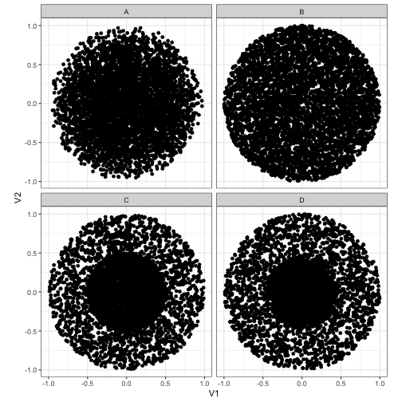
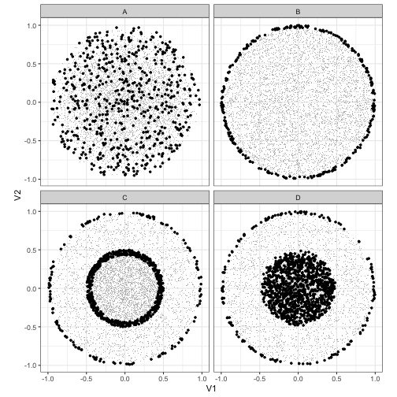
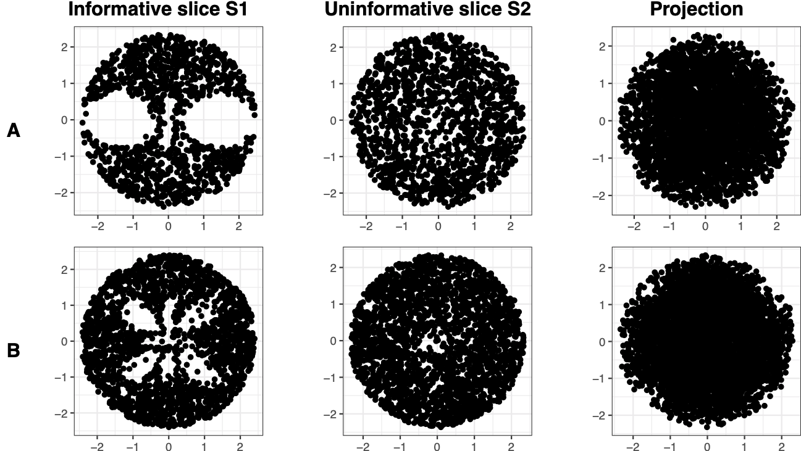
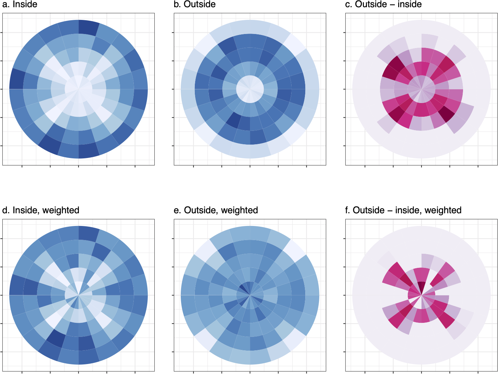
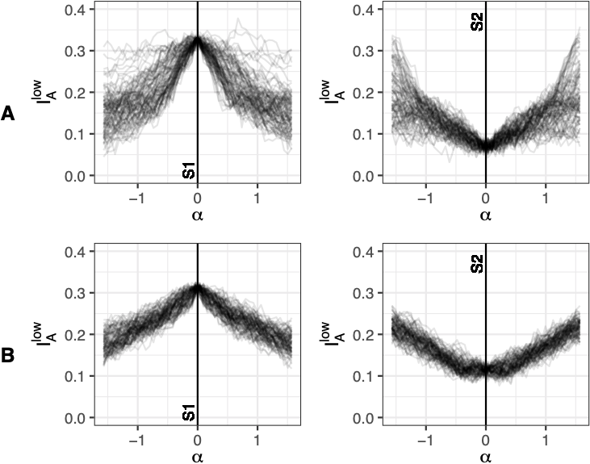
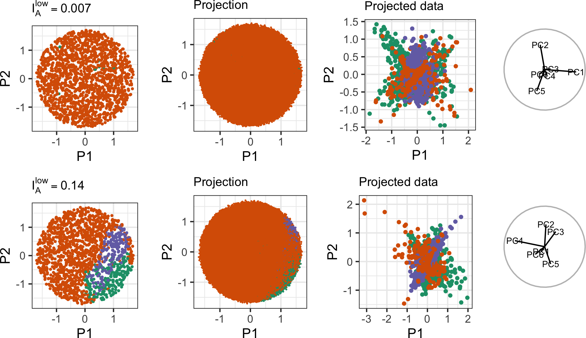

layout: false
class: split-75
background-image: url("plots/title_slide_bkg.png")
background-position: center
background-size: contain

<style type="text/css">
.remark-slide-content{
font-size: 34px;
line-height: 1.2;

}
code.r{
  font-size: 24px;
}

</style>

```{r setup, include=FALSE}
options(htmltools.dir.version = FALSE, width = 120)
library(tidyverse)
library(knitr)
library(kableExtra)
library(htmltools)
opts_chunk$set(
  echo = TRUE, warning = FALSE, message = FALSE, comment = "#>",
  fig.path = 'figure/', cache.path = 'cache/', fig.align = 'center',
  fig.width = 12, fig.height = 4, fig.show = 'hold',
  cache = FALSE, external = TRUE, dev = 'png', dev.args = list(bg = "transparent")
)
mp4_vid <- function(src, width){
  HTML(
    paste0(
      '<video width="', width, '" loop autoplay>
        <source src="', src, '" type="video/mp4">
      </video>'
    )
  )
}
```


```{css, echo=FALSE}
/* custom.css */
:root{
  --main-color1: #509e2f;
  --main-color2: #bcbddc;
  --main-color3: #efedf5;
  --main-color4: #9DDAE5;
  --text-color3: black;
  --text-color4: #505050;
  --code-inline-color: #4e5054;
  --link-color: #006CAB;
}
.large { font-size: 150% }
.largeish { font-size: 120% }
.summarystyle { font-size: 150%;
  line-height:150%;}
.my-gray {color: #606060!important; }
.tiny{ font-size: 25%}
```


.column[.content[


# **Section Pursuit**

**Based on arXiv:2004.13327**

.my-gray[
.large[**Ursula Laa**]

.largeish[ Institute of Statistics <br>
Department of Landscape, Spatial and Infrastructure Sciences <br>
University of Natural Resources and Life Sciences
]
]

WU Statistics and Mathematics Research Seminar, 14/01/2021

]]

.column[.top_abs.content[

]]

---
# Visualizing multivariate data

When we want to look at a distribution in more than 2 or 3 dimensions we often reduce the dimensionality first:

- We can apply **linear projections**, these appear in a scatterplot matrix, or when we are making a **biplot** after applying principal component analysis. More generally **projection pursuit** is finding a linear projection that is optimal under some criterion.
- If linear projections are not enough to resolve the features in a distribution, we may turn to **non-linear dimension reduction** (NLDR) methods like t-SNE. These typically aim to capture **local** structure and will warp the overall distribution, and we are losing the interpretability of linear methods.

Alternative approach: use the **grand tour**


---
# The grand tour

The **grand tour** displays a sequence of smoothly **interpolated projections**, and can reveal the shape of the distribution, clusters and outliers. It provides insights beyond showing single linear projections, while keeping interpretability in terms of the original parameters.

In the grand tour projection planes are randomly selected from all possible projections and then interpolated along geodesic paths. By showing the projected data for each of the projections along the path we generate an animation that shows slowly the data under a slow rotation of the viewing angle.

A good way of understanding how this works is to look at grand tour animations of geometric objects.

---
# The grand tour examples

Short grand tour paths showing a hypercube in 4D, a posterior sample from gravitational wave astronomy in 5D and the grouping of particle physics experiments based on how they constrain our models in 6D.

<iframe src="4cube.html" width="305" height="400" scrolling="no" seamless="seamless" frameBorder="0"> </iframe>
<iframe src="bbh.html" width="305" height="400" scrolling="no" seamless="seamless" frameBorder="0"> </iframe>
<iframe src="pdfsense.html" width="305" height="400" scrolling="no" seamless="seamless" frameBorder="0"> </iframe>

---
# The guided tour

The grand tour will show randomly selected projections of the data, but those can often be uninteresting. As the number of variables grows, most projections will look like normal distributions (Diaconis and Freedman, 1984), and it can be difficult to identify interesting views of the data.

On the other hand **projection pursuit** (Kruskal, 1969) is optimizing an index of **interestingness** over the space of all possible projections to show the most interesting view of the data. A lot of different index functions have been proposed, typically we are measuring the deviation from a normal distribution in some way.

The **guided tour** is trying to combine these two to get the best of both: we pick new target planes based on an projection pursuit index function.

---
# What is hidden in projections?

.pull-left[]
--
.pull-right[ ]

---
# Combining sectioning and projections


**Sectioning** in visualization means that we select a subset of points that are kept or **highlighted** in a view of the data. The subset is generally defined by a set of **inequality conditions** defining the **section**.

Combining projections and sections of the data can provide the viewer with new insights, as discussed in *Furnas and Buja (1994)*. The combination is referred to as **prosections** and it was shown how they can be used to determine the intrinsic dimensionality of a distribution.

More generally sectioning can be useful to reveal features that are hidden in all projections of the data, but typically relies on user interaction (**linked brushing**). However, if we can define a systematic approach to sectioning we could also allow a systematic exploration of sections, either visually or through **section pursuit**.

---
# Slicing

We can define sections based on projections of the data: a **slice** is using the **orthogonal distance** of each data point from a centered projection plane to define a section, see *UL, Cook, Valencia (2019)*. Points close to the plane are **highlighted** in the projected view and can be compared to the overall (projected) distribution of points.

.center[]


---
# The slice tour

Each view in the grand tour is defined by a projection matrix, that can also be used to define a *slice* of the data. We can show the projected data while highlighting the points inside the current slice to define the **slice tour**.

.center[
<div >
    <div style="width: 33%; float: left">
        <b> 3D sphere </b>
        <a href="">

        </a>
    </div>
        <div style="width: 33%; float: left">
       <b>4D torus</b>
        <a href="">
        </a>
    </div>
    <div style="width: 33%; float: left">
        <b>Roman surface</b>
        <a href="">
        </a>
    </div>
    </div>
]


---
# What makes a slice interesting?

A first approach to **section pursuit** is therefore to optimize a section pursuit index function over all possible **slices** of the data. If we keep the projections centered through the mean, and the slice thickness fixed, this means we are optimizing over all possible projections and can use methods from **projection pursuit** in combination with information about the orthogonal distances.

One approach would be to directly plug in index functions from the projection pursuit literature, but compute them only for the points inside the slice.

However, in this case we have a direct comparison: how is the distribution **inside** the slice different from the **projected** distribution? An interesting slice would be one that reveals a difference between the two!

---
# Notation

- The projected data points are computed as $Y=X\cdot A$, where $X$ is an $n\times p$ data matrix, $A$ is a $p\times d$ (orthonormal) basis for the $d$-dimensional space onto which the data is being projected
- To generate a 2-dimensional slice we compute the orthogonal distance between every point and the plane (defined by $A = (\mathbf{a}_1, \mathbf{a}_2)$) as the Euclidean norm
\begin{equation}
h_i = ||\mathbf{x}_i - (\mathbf{x}_i\cdot \mathbf{a}_1) \mathbf{a}_1 - (\mathbf{x}_i\cdot \mathbf{a}_2) \mathbf{a}_2||.
\end{equation}
- Observations are considered inside the slice if $h_i < h$.
- We denote the set of points inside the slice $S$, and the set of points outside the slice $C$.

---
# Notation

- The two sets are separately binned into $K$ bins: $S_{k}=\sum_{i} I(Y_i \in b_{k})I(h_i < h)$ and $C_{k}=\sum_{i} I(Y_i \in b_{k})I(h_i \geq h)$
- The relative counts are denoted $s_k = S_k / \sum_i S_i$ and $c_k = C_k / \sum_i C_i$

Using these relative counts $s_k$ and $c_k$ we will build an index that compares the two distributions, this is based on the decomposition proposed in *Gous and Buja (2012)*.

---
# Index definition

We define two index functions that aim to detect either regions of low density (holes) or high density (up, grains) inside the slice distribution:

\begin{equation}
I_A^{low} = \sum_{k}\left[\left(c_{k}-s_{k}\right)\right]_{>\varepsilon},
\label{eq:index}
\end{equation}

\begin{equation}
I_A^{up} = \sum_{k}\left[\left(s_{k}-c_{k}\right)\right]_{>\varepsilon}
\label{eq:indexup}
\end{equation}

where we only sum up positive differences above the threshold value $\varepsilon$ (based on the estimated size of sampling fluctuations).

---
# Index definition (generalization)

We also consider generalizing the definition to

\begin{equation}
I_A^{low} = \sum_{k}w_{k}\left(\left[c_{k}^{1/q}-s_{k}^{1/q}\right]_{>\varepsilon}\right)^{q},
\label{eq:index2}
\end{equation}
\begin{equation}
I_A^{up} = \sum_{k}w_{k}\left(\left[s_{k}^{1/q}-c_{k}^{1/q}\right]_{>\varepsilon}\right)^{q}.
\label{eq:index2up}
\end{equation}

allowing for bin-wise weights $w_k$ and where $q$ controls the sensitivity to small differences.

---
# Practial considerations

When computing this index in practice, we will see systematic differences between $S$ and $C$ that depend on the underlying distributions. To proceed we will make a few assumptions:

- The data shall be distributed inside a hypersphere (no systematic differences based on from which angle we are looking at it)
- In the absence of structure we will assume points to be distributed uniformly within the sphere (capturing volume effects rather than assuming specific structure, one alternative could be a multivariate normal distribution instead)
- We will use polar binning in the 2D projection plane (in $r$ and $\theta$)

With these assumptions we can study the expected differences between the two distributions, and define a **bin-wise** reweighting scheme for $S$ and $C$ separately.

---
# Simulated data example

To illustrate the method we simulated a large sample of points inside a hypersphere, but with *holes* that are defined through hyperspherical harmonics, such that some slices are interesting and others are not. 

.center[]

---
# Reweighting in action

We can compare the binned distributions with and without reweighting to see why this is important, for example looking at S1 from set B:

.center[]

---
# Tracing the index

To understand the index performance we can show how the index value changes as we slowly rotate the angle of the projection away from the most or least informative slice:

- Start by randomly selecting a large number directions along which we move away from the starting plane.
- Use geodesic interpolation (as available in the `tourr` package) to interpolate projections along those directions, up to a maximum angle $\alpha$.
- Evaluate the index value for each slice along the interpolated path.
- The **topotrace plot** shows how the index value changes with $\alpha$, we can see characteristics of the index function (smoothness, squint angle) and if there are local maxima or ridges for the considered distribution.


---
# Tracing the index

.center[]


---
# Example application

We can use section pursuit to better understand non-linear boundaries in high-dimensional spaces:

- Classification boundaries, for example from a SVM with polynomial or radial kernel
- Boundaries from inequality conditions, for example physically meaningful regions in a parameter space

We start by **sampling** points parameter space: points are drawn uniformly within a p-dimensional hypersphere. We then **evaluate** the model predictions or inequality conditions for all samples, and create **hollow** regions by dropping points from one class, or where the inequality condition is not met.


---
# Example application

**Example**: Classification problem from physics (PDFSense data), with three groups in six dimensions. When fitting a SVM with radial kernel we find that across most of the parameter space we predict one of the three groups. Where are sections with predictions for the other two?

- Use the `classifly` package to sample in a grid across the 6D parameter space and evaluate predictions for all points.
- Shave points to go from a hypercube to a hypersphere.
- Input to section pursuit is the set of points for which the prediction is the most commonly predicted class (filling most of the hypersphere).
- Use section pursuit to identify a slice where this set of points shows a large *hole* - we get a larger fraction of alternative predictions in this section of the parameter space.
- Show all samples with their predicted class in this slice.

---
# Example application

.center[]

---
# Summary and Outlook

- We can define **section pursuit** using slices, and optimizing an index that compares the projected distribution to that inside the slice.
- In doing so we make **assumptions** about the underlying distribution to adjust for expected differences (and estimate the expected fluctuations $\varepsilon$).
- One application is to find interesting slices to better **understand non-linear decision boundaries** or inequality conditions.
- The current implementation is **limited** to datasets with large sample size and intermediate number of dimensions (up to seven dimensions were considered so far).
- There is a lot of room to develop **additional index functions** for section pursuit and further develop the proposed generalization, and for **better optimization** methods.
- Alternative **definitions of sectioning** should also be considered to generalize the method.


---
layout: false
background-image: url("plots/title_slide_bkg.png")
background-position: center
background-size: contain

# Thanks!

<br>

This is joint work done in collaboration with **Dianne Cook**, **German Valencia** and **Andreas Buja**.


My slides are made using `RMarkdown`, `xaringan` and the `ninjutsu` theme.
The main `R` packages used are `tourr`, `classifly` and the `tidyverse`.
